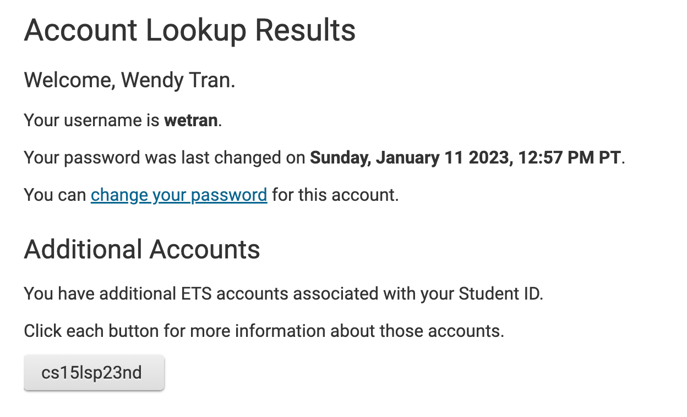

# Lab Report 1
*Report by: Wendy Tran*

Hello incoming 15L students or the future me! This is a tutorial on how to log into a course-specific account on ieng6 remotely.

## Step 1:

Look up your course-specific account for CSE15L [here](https://sdacs.ucsd.edu/~icc/index.php).

This is what you should see as you log into your account:

Click on the button with `cs15lsp23` on it. That will also be your CSE 15L username.
You will then be redirected to a page with all your account details as well as a notice to set your password for your new account. 

You **must** perform this action in order to proceed with the next steps.

When prompted to enter your username, make sure to input your CSE15L username, not your actual school email in order to ensure that only your CSE15L password is changed. For example:

Continue to follow the instructions and prompts until you have successfully set your password for your CSE 15L account.

## Step 2:
Our next step is to install Visual Studio Code. I had already installed VS Code for other courses, but if you haven't yet, click the link [here](https://code.visualstudio.com/) and follow the instructions to download and install it on your computer.

Once downloaded, you should be met with this screen:

## Step 3

Next, we will be installing `git` in order to remotely log in to our  student account. For users operating on **Windows**, follow the steps [here](https://gitforwindows.org/) in order to use `git bash` on Visual Studio Code which can also be demonstrated [here](https://stackoverflow.com/a/50527994). For users operating on a **MacOS** operating system, `git` should already be installed.

After installing `git`, open the terminal in VSCode using either Ctrl/Command +, or manually open the Terminal, locating on the bottom of the VSCode Application.

Use `ssh` by typing in `ssh cs15lsp23zz@ieng6.ucsd.edu`, with `zz` replaced by the letters of your course username.

The first time you log into the server, you should receive a message like this:

Type `yes` to the response and enter the new password you created for the CSE15L account. **Note: It is normal for nothing to appear when you're typing in your password; the terminal is actively collecting the characters to your password and is hiding it for security.** Click enter once you're finished typing in your password. If the login in successful, you should be seeing a similar screen to this:

Now, you are logged in remotely to a computer in the CSE Basement! These are some specific useful commands we will be trying:
- `cd ~`
- `cd`
- `ls -lat`
- `ls -a`
- `ls /home/linux/ieng6/cs15lspw3/cs15lsp23abc` where `abc` is a username
-  `cp /home/linux/ieng6/cs15lsp23/public/hello.txt ~/`
-  `cat /home/linux/ieng6/cs15lsp23/public/hello.txt`

This should be what the results are:

- `cd ~` is used to return to a user's home directory
- `cd` is used to to move berween directories
- `ls -lat` is used to list files or directories
- `ls -a` is used to list files or directories including hidden files or directories
- `ls /home/linux/ieng6/cs15lspw3/cs15lsp23abc` is used to list files or directories within that file path
- `cp /home/linux/ieng6/cs15lsp23/public/hello.txt ~/` is used to copy the text file
- `cat /home/linux/ieng6/cs15lsp23/public/hello.txt` is used to display the text file

## Step 4
In order to log out of the remote server, you can either use `Ctrl-D` or run the command `exit`

By following these steps, you should be able to successfully log in to your CSE 15L account on terminal remotely!
